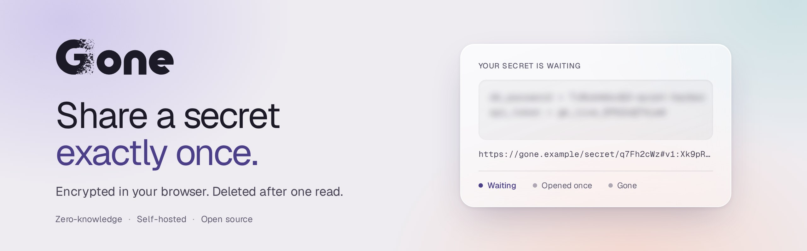
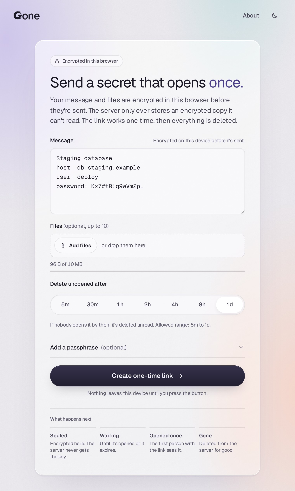
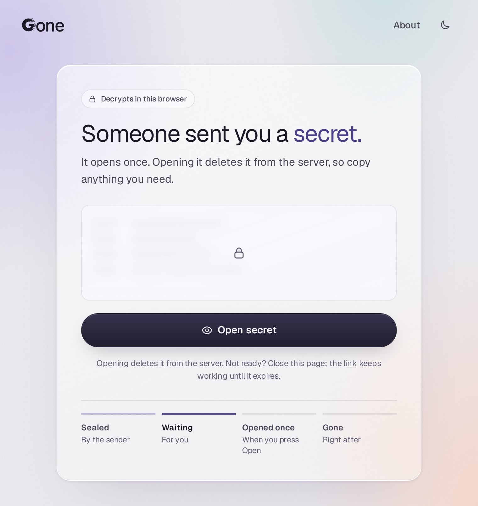

<picture>
  <source media="(prefers-color-scheme: dark)" srcset="docs/brand/hero-dark.jpg">
  
</picture>

[](https://github.com/haukened/gone/actions/workflows/build.yaml)
[](https://github.com/haukened/gone/actions/workflows/sec.yaml)
[](https://scorecard.dev/viewer/?uri=github.com/haukened/gone)
[](https://www.bestpractices.dev/projects/15214)
[](https://app.codacy.com/gh/haukened/gone/dashboard?utm_source=gh&utm_medium=referral&utm_content=&utm_campaign=Badge_grade)
[](https://app.codacy.com/gh/haukened/gone/dashboard?utm_source=gh&utm_medium=referral&utm_content=&utm_campaign=Badge_coverage)

[](https://github.com/haukened/gone/releases/latest)


*Because security shouldn't live behind paywalls.*

Go + One = Gone — a tiny service for sharing a secret exactly once.

Gone lets you paste a sensitive value (password, token, wifi key), generate a one‑time link, and send that link. The first person to open it sees the secret; after that it’s gone for good.

**Try it:** [gone.hauken.us](https://gone.hauken.us), a public instance run by the maintainer. Secrets can be up to 10 MB and are deleted after a day if nobody opens them. No uptime guarantee; limits may change.

<table>
<tr>
<td width="33%" valign="top"><a href="docs/img/send-light.jpg"><picture><source media="(prefers-color-scheme: dark)" srcset="docs/img/send-dark.jpg"></picture></a></td>
<td width="33%" valign="top"><a href="docs/img/open-light.jpg"><picture><source media="(prefers-color-scheme: dark)" srcset="docs/img/open-dark.jpg"></picture></a></td>
<td width="33%" valign="top"><a href="docs/img/revealed-light.jpg"><picture><source media="(prefers-color-scheme: dark)" srcset="docs/img/revealed-dark.jpg"></picture></a></td>
</tr>
<tr>
<td align="center"><b>Send</b><br>Encrypted in your browser</td>
<td align="center"><b>Open</b><br>One click, then it's deleted</td>
<td align="center"><b>Read</b><br>Hidden until you show it</td>
</tr>
</table>

---

## 1. Quick Start

> [!IMPORTANT]
> **Gone needs HTTPS.** Browsers only allow the encryption Gone uses (WebCrypto) on secure pages. Over plain `http://`, Gone shows a warning, turns off sending, and won't open links. The one exception is `http://localhost` on the machine running Gone, which browsers treat as secure.

### Try it on this machine

```sh
docker run --rm -p 8080:8080 ghcr.io/haukened/gone:latest
```

Visit http://localhost:8080, paste a secret and/or attach files, pick an expiry, copy the generated link, send it. The recipient opens the link, the secret displays once, and the server deletes it as soon as their browser confirms it received everything.

This only works from the same machine. Another device visiting `http://<this-ip>:8080` gets an insecure page, so sending is turned off there.

### Run it for real, behind Caddy

[`deploy/compose.yaml`](deploy/compose.yaml) runs Gone behind [Caddy](https://caddyserver.com), which gets and renews a Let's Encrypt certificate on its own. You need a DNS name pointing at the server and ports 80 and 443 open to the internet.

```sh
mkdir gone && cd gone
curl -fsSLO https://raw.githubusercontent.com/haukened/gone/main/deploy/compose.yaml
curl -fsSLO https://raw.githubusercontent.com/haukened/gone/main/deploy/Caddyfile
GONE_DOMAIN=gone.example.com docker compose up -d
```

Then visit https://gone.example.com. Only Caddy is published; Gone listens on a private Docker network, keeps its data in the `gone-data` volume, and trusts Caddy's `X-Forwarded-For` so rate limits apply per visitor. Put `GONE_DOMAIN=…` in a `.env` file next to `compose.yaml` to skip typing it, and add any [configuration](#3-configuration) under `environment:`.

### Already have a reverse proxy?

Any proxy that terminates TLS works: nginx, Traefik, HAProxy, or a Cloudflare Tunnel. Forward to Gone's port `8080` and set `GONE_TRUSTED_PROXIES` to the proxy's address (see [Behind a reverse proxy](#behind-a-reverse-proxy)). Don't expose port `8080` itself to other machines.

Want metrics? (optional)
```sh
docker run --rm \
	-p 8080:8080 -p 9090:9090 \
	-e GONE_METRICS_ADDR=0.0.0.0:9090 \
	-e GONE_METRICS_TOKEN=tok \
	ghcr.io/haukened/gone:latest
```

Fetch metrics snapshot:
```sh
curl -H 'Authorization: Bearer tok' http://localhost:9090/
```

Health: the image has a Docker `HEALTHCHECK` that runs `goned healthcheck` every 30 seconds. It is a one-shot probe, not a second server: it calls the running server's `/readyz` on `GONE_ADDR` (loopback when the address is `:port` or unspecified) and exits `0` when ready, `1` otherwise. `docker ps` shows the result. Kubernetes can probe `/healthz` and `/readyz` directly.

---

## 2. Basic Usage
1. You type a secret and/or attach files (any type, up to 10 files; message + files share the `GONE_MAX_BYTES` cap) in the web form and choose how long it should live (its TTL).
2. Your browser encrypts it locally before it ever leaves your machine.
3. The server stores only the encrypted blob plus when it should expire.
4. You get a link like: `https://example/secret/abcd#v1:ENC_KEY_MATERIAL`.
5. You send that full URL (including everything after the `#`) to someone.
6. When they open it, the server hands their browser the encrypted blob, the browser decrypts it locally using the part after `#`, then tells the server to delete it.
7. A refresh or second visit won’t work—the secret is already gone.
8. Want a second lock? Open **Add a passphrase** on the form, type one or press **Generate** for five random words, and send the passphrase to the recipient separately from the link. They need both to open the secret.
9. Changed your mind? Before you leave the result page, open **Manage this secret** to get a private manage link. Keep it for yourself: it shows whether the secret is still waiting and lets you delete it before anyone opens it.
10. Need a secret from someone else? Choose **Request a secret** in the header. Your browser makes a key pair and gives you a link to send them. They type the secret on that page and it's encrypted to your browser; it shows up on your **Request a secret** page, and opens once, only in the browser that made the request.

Guarantees (simple terms):
* Server never learns the plaintext.
* Link works only one time.
* Expired or used links are dead.
* With a passphrase, a leaked link alone can't open the secret.
* Your manage link can never reveal the secret, and once the secret is opened, deleted, or expired, the server keeps no record that it existed.
* A request's reply can only be opened in the browser that asked for it; its private key never leaves that browser.

### From the command line
The `gone` CLI does the same from a terminal, and works with secrets sent from the browser and the other way round. Download a static binary from the [releases page](https://github.com/haukened/gone/releases) (verify it with `gh attestation verify <archive> --repo haukened/gone`), then:

```sh
printf 'hunter2' | gone send --ttl 30m              # prints the link and your manage link
gone get 'https://gone.hauken.us/secret/AbC#v1:…'  # quote links in single quotes
gone status '<manage-link>'                         # or: gone revoke '<manage-link>'
```

Messages are read from standard input, never from arguments. Add `-f FILE` for attachments, `--passphrase-prompt` or `--passphrase-generate` for a passphrase, and `--json` for scripts. Point it at your own server with `--server`, `GONE_SERVER`, or `gone set server <url>`. Like the browser, it only talks to `https://` servers; `--insecure` allows `http://` for a server on `localhost` and nowhere else. Scripts and AI agents can handle secrets by reference: `--message-file` sends a file's contents, `gone get - --message-out FILE` reads the link from standard input and writes the message to a new `0600` file, so the plaintext never appears in their output (see [Scripts and agents](docs/cli.md#scripts-and-agents)). The full guide, with exit codes and JSON formats, is [docs/cli.md](docs/cli.md).

---

## 3. Configuration
Environment variables only (no flags, no config files):

| Variable | Description | Default |
|----------|-------------|---------|
| `GONE_ADDR` | Listen address: an IP literal and port (`127.0.0.1:8080`, `[::1]:8080`) or `:port`. Hostnames such as `localhost` are rejected. | `:8080` |
| `GONE_DATA_DIR` | Data directory (SQLite DB + blobs). | `/data` |
| `GONE_INLINE_MAX_BYTES` | Max ciphertext size stored inline in SQLite. | `8192` |
| `GONE_MAX_BYTES` | Absolute max secret size in bytes (message + attachments combined). | `10485760` (10 MiB) |
| `GONE_TTL_OPTIONS` | Comma list of selectable TTLs. Needs at least two distinct values. | `5m,30m,1h,2h,4h,8h,24h` |
| `GONE_CLAIM_LEASE` | How long an opened secret is reserved for the recipient's browser to finish downloading and confirm deletion. If it never confirms (closed tab, network drop), the secret is deleted when the lease lapses. Max `15m`. | `2m` |
| `GONE_METRICS_ADDR` | Optional metrics listener address. | (empty) |
| `GONE_METRICS_TOKEN` | Bearer token for the metrics endpoint. Metrics stay disabled unless both this and `GONE_METRICS_ADDR` are set. | (empty) |
| `GONE_RATE_CREATE` | Per-client budget for creating secrets, as `N/s`, `N/m`, or `N/h` (`N` up to 1,000,000). `0` disables it. | `10/m` |
| `GONE_RATE_READ` | Per-client budget for opening and acknowledging secrets (`GET`/`DELETE`) and for the sender's status and revoke calls. `0` disables it. | `30/m` |
| `GONE_RATE_BURST` | Requests a client may make back to back before the rate applies (1–1000). | `10` |
| `GONE_TRUSTED_PROXIES` | Comma list of proxy IPs/CIDRs whose `X-Forwarded-For` header is trusted. Prefixes broader than `/8` (IPv4) or `/32` (IPv6) and IPv4-mapped IPv6 addresses are rejected. | (empty) |

Derived automatically:
* MinTTL / MaxTTL = smallest / largest in `GONE_TTL_OPTIONS` (accepted range is any duration inside that span, not just the listed ones).
* SQLite DSN → `<GONE_DATA_DIR>/gone.db` (WAL mode, FULL sync enforced).

TTL Format: comma‑separated Go durations using `s`, `m`, `h` (e.g. `30s,5m,90m,2h`). Day and week units (`d`, `w`) are not accepted; write `24h` or `168h`.

### Behind a reverse proxy
The proxy must serve Gone over HTTPS; browsers won't encrypt or decrypt on a plain-HTTP page. [`deploy/compose.yaml`](deploy/compose.yaml) is a ready-made Caddy setup.

Rate limits key on the client address (IPv4 `/32`, IPv6 `/64`). Behind a load balancer or reverse proxy every request appears to come from the proxy, so all users share one budget. Set `GONE_TRUSTED_PROXIES` to the proxy's address (e.g. `10.0.0.0/8` or `172.18.0.2`) so gone reads the real client from `X-Forwarded-For`. Only list proxies you control: a trusted proxy can make any request look like it came from any address. If `X-Forwarded-For` arrives from an untrusted peer, gone ignores it and logs a one-time warning.

Limits are kept in memory per process, so with several replicas the effective budget is the configured budget times the replica count.

---

## 4. Metrics (Optional)
Disabled unless both `GONE_METRICS_ADDR` and `GONE_METRICS_TOKEN` are set (an address without a token logs a warning and leaves metrics off). When enabled, clients must supply `Authorization: Bearer <token>`.

JSON snapshot example:
```json
{
	"counters": {
		"secrets_created_total": 123,
		"secrets_consumed_total": 118,
		"secrets_expired_deleted_total": 47
	},
	"summaries": {
		"janitor_deleted_per_cycle": {"count": 42, "sum": 420, "min": 1, "max": 25}
	}
}
```

Definitions:
| Name | Type | Meaning |
|------|------|---------|
| `secrets_created_total` | counter | Secrets stored |
| `secrets_consumed_total` | counter | Secrets consumed & deleted |
| `secrets_expired_deleted_total` | counter | Secrets the janitor removed: expired ones and opened ones whose claim lease lapsed |
| `secrets_claims_expired_total` | counter | Opened secrets deleted because the recipient never confirmed receipt within the claim lease (a subset of `secrets_expired_deleted_total`) |
| `secrets_revoked_total` | counter | Secrets the sender deleted with the manage link before they were opened |
| `rate_limited_create_total` | counter | Create requests rejected with `429` by the per-client create budget |
| `rate_limited_read_total` | counter | Read, acknowledge, status, and revoke requests (`/api/secret/{id}` and its `/status` and `/revoke`) rejected with `429` |
| `requests_created_total` | counter | Secret requests opened |
| `requests_filled_total` | counter | Secret requests answered |
| `requests_opened_total` | counter | Request replies opened and deleted |
| `requests_cancelled_total` | counter | Requests (or unopened replies) the requester cancelled |
| `requests_expired_total` | counter | Requests the janitor removed because nobody answered in time |
| `janitor_deleted_per_cycle` | summary | Distribution of expirations per janitor run |

Persistence notes:
* In‑memory metrics flushed periodically to SQLite; snapshot merges persisted + current deltas.
* Graceful stop attempts a final flush.

Enable + fetch quickly:
```sh
GONE_METRICS_ADDR=127.0.0.1:9090 GONE_METRICS_TOKEN=tok \
	go run ./cmd/goned &
curl -H 'Authorization: Bearer tok' http://127.0.0.1:9090/
```

---

## 5. API Specification
OpenAPI file: `docs/openapi.yaml` (enumerates every emitted status code).
Importable into Postman / Insomnia / ReDoc.

---

>[!NOTE]
> Everything below this line is advanced detail for operators and developers.
> Read on if you're curious, but most people can stop here.

---

## 6. Build & Run (Local Dev)
This project uses [Task](https://taskfile.dev) (`Taskfile.yml`) to coordinate building the binary and (for production) minifying and embedding static assets.

Please first install Task: https://taskfile.dev/docs/installation

Core tasks:
| Task | What it does |
|------|---------------|
| `task dev` | Clean + build development binaries (`bin/goned` server and `bin/gone` CLI; no minified assets, no `-tags=prod`). |
| `task prod` | Full production build: clean, minify assets into `web/dist`, build `bin/goned` with `-tags=prod` and `bin/gone`. |
| `task release -- vX.Y.Z` | Cross-build the release archives, `SHA256SUMS`, and release notes into `dist/` (what the tag workflow publishes). |
| `task run` | Convenience: rebuild dev binary and run with a temporary data dir. It sets `GONE_METRICS_ADDR=:9090`, but metrics stay off (with a warning) unless you also set `GONE_METRICS_TOKEN`. |
| `task cover` | Run Go tests with coverage output. |
| `task test` | Run Go and JavaScript unit tests. |
| `task lint` | Run Go linters with golangci-lint for default and `dev` build tags. |
| `task lint-web` | Lint JavaScript (ESLint) and CSS (stylelint) via `npx`, matching CI. |
| `task test-js` | Run JavaScript unit tests (`node --test`, Node 20+, no npm install). |
| `task cover-js` | Run JavaScript unit tests with coverage output. |
| `task perf` | Check the latency target (p95 under 50ms at 100 req/s) against the real stack. Set `TMPDIR` to a directory on the disk you deploy on to benchmark that disk; CI runs it on RAM, so it checks the code, not the runner's disk. |

Development build:
```sh
task dev
./bin/goned
```

Production build (minified assets embedded):
```sh
task prod
./bin/goned
```

Run with overrides (development example):
```sh
GONE_ADDR=127.0.0.1:8080 \
GONE_DATA_DIR=$(pwd)/data \
GONE_TTL_OPTIONS="5m,30m,1h" \
GONE_MAX_BYTES=$((10*1024*1024)) \
GONE_METRICS_ADDR=127.0.0.1:9090 \
GONE_METRICS_TOKEN=localtok \
./bin/goned
```

Or just:
```sh
task run
```

Gone is pure Go (SQLite via [`modernc.org/sqlite`](https://pkg.go.dev/modernc.org/sqlite)), so it builds with `CGO_ENABLED=0` into a fully static binary; `task prod` does this by default. Requires Go 1.27+.

Go linting is configured by `.golangci.yml`, including the revive rules. Run `task lint` and `task lint-web` before opening a PR; CI runs both.

### Container image
The `Dockerfile` uses [Docker Hardened Images](https://dhi.io): `dhi.io/golang` (builder) and the distroless `dhi.io/static` runtime (no shell or package manager; runs as UID `65532`). Both are pinned by digest and kept current by Dependabot.

Pulling DHI images needs a (free) Docker Hub account:
```sh
docker login dhi.io
docker build -t gone .
```

The release workflow publishes multi-arch (`linux/amd64`, `linux/arm64`) images with SBOM and provenance attestations, and requires the repository secrets `DOCKERHUB_USERNAME` and `DOCKERHUB_TOKEN` to pull the base images.

---

## 7. Storage & Persistence
* Metadata (IDs, expiry, consumed state) → SQLite (WAL, FULL sync).
* Ciphertext: inline if ≤ `GONE_INLINE_MAX_BYTES`; otherwise filesystem blob under `blobs/` in data dir.
* Expirations and lapsed claims cleared by janitor; deletion is immediate once the recipient acknowledges receipt.

---

## 8. Security & Architecture (Deep Dive)
This section is intentionally lower in the file—most users can stop above.

### Encryption & One‑Time Retrieval (Protocol v1)
The normative byte-level specification, including the envelope format, sanitization rules, and shared test vectors, is [docs/protocol.md](docs/protocol.md).

1. Browser creates random AES‑GCM key + nonce (Web Crypto API).
2. Encrypts plaintext with AAD `gone:v1`. A text‑only secret is raw UTF‑8; a secret with files is a `GONE2` envelope (magic, JSON header listing the message length and each file's name/type/size, then message bytes, then file bytes) so file names and types are encrypted too.
3. Sends ciphertext + nonce (`X-Gone-Nonce`) + version (`X-Gone-Version`). Key never leaves browser.
4. Server stores ciphertext + metadata only.
5. Response returns secret ID + expiry + a random manage token. The server keeps only the token's SHA‑256.
6. Share link: `https://host/secret/{id}#v1:<base64url-key>`. Manage link (sender only): `https://host/manage/{id}#<manage-token>`.
7. First `GET /api/secret/{id}` atomically *claims* the secret and streams the ciphertext with a random claim token (`X-Gone-Claim`) and lease expiry (`X-Gone-Claim-Expires`). Any other GET without that token gets `404`, exactly as if the secret were gone.
8. If the download is interrupted, the browser retries the GET with `X-Gone-Claim` to receive the same ciphertext again (until the lease lapses).
9. Browser checks the byte count, decrypts locally (AES‑GCM authenticates every byte), then sends `DELETE /api/secret/{id}` with `X-Gone-Claim`; the server deletes the record and blob (`204`).
10. If no acknowledgement arrives before `GONE_CLAIM_LEASE` lapses, the janitor deletes the secret anyway. It is never served to a second party.
11. The sender's manage page sends the token in `X-Gone-Manage` to `GET /api/secret/{id}/status` (still pending?) or `POST /api/secret/{id}/revoke` (delete now).

Properties:
* Compromise yields only ciphertext & nonces.
* Must possess both path ID and fragment key.
* Atomic claim (only the token holder can re-fetch) prevents replay; only a SHA‑256 hash of the claim token is stored.
* AES‑GCM integrity + fixed AAD protect against tamper.
* Manage tokens: 256 random bits, carried only in the URL fragment and the `X-Gone-Manage` header (never in a path, query, or log), stored only as a SHA‑256 hash, and compared in constant time. The custom header forces a CORS preflight that the server never grants, so other sites cannot revoke your secrets.
* No tombstones: status and revoke answer `404` alike for opened, revoked, expired, unknown, and wrong‑token secrets, so the server's answers reveal nothing beyond "still pending".

### Optional Passphrase (Protocol v2)
A sender can add a passphrase. The link keeps the same shape with a `v2:` prefix (`#v2:<base64url-key>`), but the AES‑GCM key also depends on the passphrase. Full details are in [docs/protocol.md §4.2](docs/protocol.md#42-protocol-version-2-passphrase).

1. Browser picks a random 32‑byte link key, 16‑byte salt, and 12‑byte nonce.
2. It stretches the passphrase (NFC‑normalized UTF‑8) with PBKDF2‑SHA‑256 at 600,000 iterations, then combines the result with the link key using HKDF‑SHA‑256 to get the AES‑GCM key.
3. The upload body is a 21‑byte header (KDF ID, iteration count, salt) followed by the ciphertext. The header is bound into the AAD (`gone:v2` + header), so it can't be altered. The server stores the body as opaque bytes and never sees the passphrase.
4. The recipient's page asks for the passphrase before fetching. A wrong passphrase can be retried against the downloaded ciphertext as often as needed, with no second request. The secret is acknowledged and deleted only after it decrypts.

Generated passphrases are five words from the [EFF short wordlist](https://www.eff.org/dice) (about 51 bits of entropy), © Electronic Frontier Foundation, used under [CC BY 3.0 US](https://creativecommons.org/licenses/by/3.0/us/).

### Secret Requests (Protocol v3)
A request runs the other way. Full details are in [docs/protocol.md §4.3](docs/protocol.md#43-protocol-version-3-request-reply) and [§8.6](docs/protocol.md#86-secret-requests).

1. The requester's browser makes an ECDH P-256 key pair and stores the private key in IndexedDB as a non-extractable WebCrypto key: it survives closing the browser, but no page script can read its bytes. The label they type stays in that browser too.
2. The server gets only a TTL and returns a request ID plus two random tokens: a manage token (kept by the requester) and a fill token. It stores only their SHA-256 hashes.
3. The reply link is `/reply/{id}#v3:<public key>.<fill token>`. The person holding the secret encrypts to that public key with a fresh ephemeral key (ECDH, then HKDF-SHA-256, then AES-256-GCM) and uploads one reply.
4. The requester's page checks status (read-only, no writes), then claims the reply with the manage token, decrypts it locally, and acknowledges it, exactly like opening a secret. The local key is then forgotten.

### Threat Model Snapshot
Defended:
* TLS transport assumed.
* No server knowledge of keys / plaintext.
* Atomic single claim; deletion after confirmed receipt or lease expiry.
* Sender revoke of a pending secret, authorised by a token only the sender holds.
* A request reply readable by anyone but the requester: it is encrypted to a key that never leaves the requester's browser, and can only be claimed with the requester's manage token, so the request ID alone can't burn it.
* A link that leaks before the recipient opens it, when the sender added a strong passphrase.
* Timely expiry deletion.

Partially Defended:
* Brute force ID enumeration: IDs are 128-bit random and reads are rate limited per client.
* DoS floods: per-client create and read budgets blunt single-source floods; distributed floods need upstream protection.
* Offline passphrase guessing: anyone with the link can download the ciphertext once and guess the passphrase offline. PBKDF2 slows each guess, but only a strong passphrase (such as the generated five words) keeps a leaked secret safe.

Out of Scope (current):
* Malicious browser extensions.
* Sophisticated timing side channels.
* Burning a secret: a passphrase can't stop someone with the link from opening it, which uses it up even if they never learn the passphrase. The real recipient then finds it gone, a sign the link leaked.
* URL hygiene / accidental fragment leakage (this includes the manage link: anyone holding it can revoke that secret, though never read it).
* Who answers a request: anyone holding the reply link can send the one reply, so send it only to the person who has the secret. The person replying should check the link came from who they expect, since anyone can make one.
* Losing the requester's browser storage (clearing site data, a private window) loses the request; the reply can't be opened anywhere else.
* Revoking after the recipient has downloaded the ciphertext: revoke wins over an unacknowledged claim, but cannot recall bytes already delivered.
* Large scale distributed DoS.

Operational Tips:
* Keep TTLs short for higher sensitivity.
* Restrict metrics listener to loopback or secured network.
* Backups should exclude transient expired blobs (or run quiescent snapshot).

### Future Hardening Ideas
* Optional separate KMS‑sealed metadata.
* Link burn confirmation UX.
* Structured audit events (without sensitive payload) to external sink.

---

## 9. Security Headers
Middleware sets:
* `Cache-Control: no-store`
* `Referrer-Policy: no-referrer`
* `X-Content-Type-Options: nosniff`
* `Content-Security-Policy: default-src 'none'; script-src 'self'; style-src 'self'; img-src 'self' data:; connect-src 'self'; font-src 'self'; frame-ancestors 'none'; base-uri 'none'; form-action 'self'`

Notes:
* CSP blocks inline code; only same‑origin static assets permitted (images allow data URIs).
* `frame-ancestors 'none'` removes need for X-Frame-Options.
* Dynamic pages: forced no‑store; static assets may be cached briefly.

---

## 10. Debug / Timing Instrumentation
Enable client timing logs either:
* Append `?debug=timing` to a page URL, or
* DevTools: `localStorage.setItem('goneDebugTiming','1')` then refresh.

Disable by removing parameter & clearing the key.

---

## 11. Roadmap (Excerpt)
The full plan for Gone v3 is in [docs/ROADMAP.md](docs/ROADMAP.md). Highlights:
* Rate limiting / abuse guard (done)
* Optional passphrase, a second factor alongside the link (done)
* Sender status & revoke via a private management link (done)
* Command-line client, `gone` (done; see [docs/cli.md](docs/cli.md))
* Web UI revamp (done)

All six phases shipped in v3.0.0. Since then: secret requests (protocol v3), so you can ask someone for a secret instead of sending one.

Other ideas:
* Optional Prometheus exposition
* CSP tightening & documentation
* Graceful shutdown coordination improvements

---

## 12. Contributing & Support
* **Get it:** the container image `ghcr.io/haukened/gone` (see [Quick Start](#1-quick-start)), or the `gone` CLI and `goned` server from the [releases page](https://github.com/haukened/gone/releases).
* **Report a bug or request a feature:** [open an issue](https://github.com/haukened/gone/issues/new/choose). Issues are public and searchable.
* **Report a vulnerability:** privately, as described in [SECURITY.md](SECURITY.md). Never in a public issue.
* **Contribute:** read [CONTRIBUTING.md](CONTRIBUTING.md) for the pull request process and the coding, testing, and documentation requirements.

---

## 13. License
Copyright © 2025-2026 The Gone Project Contributors.

GNU Affero General Public License v3.0 – see `LICENSE`.

The "Gone" name, wordmark, and logo are trademarks and are not licensed under the AGPLv3. Forks and modified versions must use a different name and logo – see [`TRADEMARKS.md`](TRADEMARKS.md).
