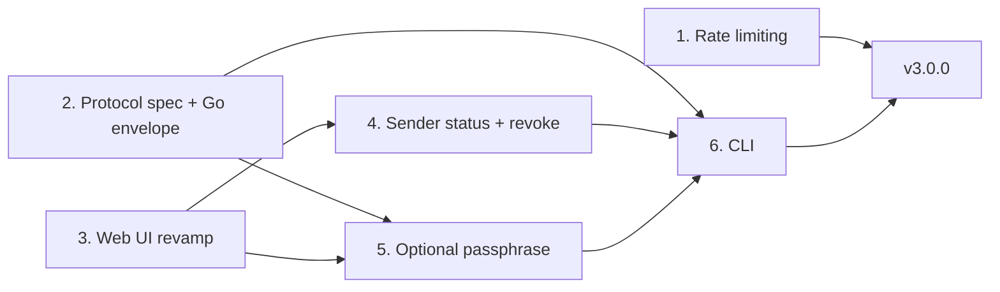

# Gone v3 Roadmap

Gone v3 adds abuse protection, a second factor for secrets, sender control, a command-line client, and a refreshed web interface. The core promise does not change: the server never sees plaintext or keys, and each secret is delivered to one recipient at most.

## Goals
* **Rate limiting** to make floods and ID guessing expensive.
* **Optional passphrase** so a leaked link alone cannot open a secret.
* **Sender status and revoke**: the sender can check whether a secret has been opened and destroy it before it is (manual, no webhooks).
* **CLI** to send and receive secrets from a terminal and in scripts.
* **Web UI revamp** so the new features feel like one product rather than add-ons.

## Non-goals
* Accounts, login, teams, or admin dashboards.
* Webhooks, email, or other push notifications.
* Secrets that can be opened more than once.
* Front-end frameworks or a build-time JS toolchain. The UI stays vanilla JS under a strict CSP.
* Running WebAssembly in the browser. Encryption stays on WebCrypto (see [Phase 2](#phase-2-protocol-spec-and-go-envelope)).

## Guiding principles
* **One phase, one pull request.** Each phase is reviewable, passes Codacy on its own, and leaves `main` releasable.
* **Zero knowledge stays intact.** No phase may give the server a key, a passphrase, or plaintext.
* **Compatible upgrades.** A v3 server still opens every v1 link created before the upgrade. Schema changes migrate automatically on startup.
* **Test coverage stays high.** Go and JS stay at or near 100% line coverage, and each phase adds tests for its new code.
* **Minimal dependencies.** Prefer the Go standard library and WebCrypto. Any new dependency needs a written reason in its PR.

## Phase order

Phases 1 and 2 are independent and can be worked on at the same time. The UI revamp comes before the two features with new screens, so those screens are built once, in the new design. The CLI comes last because it uses the API and encryption format the earlier phases settle.

---

## Phase 1: Rate limiting
**Status: done** (merged in #26).

Server-side only; the browser already shows a message on `429`.

**Scope**
* Per-client token buckets in `internal/httpx` middleware, written with the standard library.
* Separate budgets for creating secrets and for reading them. Reads include claims, acknowledgements, and Phase 4's status and revoke calls. Health probes and static assets are not limited.
* Requests over the limit get `429 Too Many Requests` with a `Retry-After` header and the usual JSON error body.
* The client address comes from the connection by default. `X-Forwarded-For` is trusted only when the request arrives from an address listed in `GONE_TRUSTED_PROXIES`.
* Idle buckets are removed on a timer, so memory stays bounded under address churn.
* New `rate_limited_create_total` and `rate_limited_read_total` metrics counters. Client addresses are never logged.

**Configuration**
| Variable | Purpose |
| -------- | ------- |
| `GONE_RATE_CREATE` | Create budget (default `10/m`) |
| `GONE_RATE_READ` | Claim, acknowledge, status, and revoke budget (default `30/m`) |
| `GONE_RATE_BURST` | Burst allowance per bucket (default `10`) |
| `GONE_TRUSTED_PROXIES` | CIDRs whose `X-Forwarded-For` header is trusted |

A budget of `0` turns that limit off.

**Done when**
* Middleware tests cover the bucket, header handling, proxy trust, and cleanup.
* `docs/openapi.yaml` documents `429` on the limited endpoints.
* The README configuration table and threat model are updated ("Brute force ID enumeration" and "DoS floods" move from out of scope to partially defended).

---

## Phase 2: Protocol spec and Go envelope
**Status: done** (merged in #27).

No user-visible change. This phase writes down the encryption format and adds a Go copy of it, so the passphrase and CLI phases have a fixed reference to build on.

**Scope**
* `docs/protocol.md`: a precise v1 specification. It covers key and nonce generation, the AAD (`gone:v1`), the `GONE2` attachment envelope byte layout, the fragment format (`#v1:<base64url-key>`), and the claim/acknowledge exchange.
* `internal/envelope` (Go standard library only): encrypt, decrypt, and pack/unpack the `GONE2` envelope.
* Shared test data in `test/vectors/*.json`, checked by both `go test` and the `node:test` suite. If the browser and Go code disagree on a single byte, a test fails.
* Decide now how format versions are numbered, so Phase 5 does not have to.

**Why not WASM:** compiling the Go code to WASM for the browser would add about 2 MB to page loads, require loosening the CSP with `'wasm-unsafe-eval'`, give up WebCrypto's hardware-accelerated AES-GCM, and leave secrets in a garbage-collected heap that cannot be wiped. Two small implementations checked against the same test data are safer and lighter.

**Done when**
* Go and JS both pass every shared test case.
* `docs/protocol.md` is linked from the README and `docs/README.md`.

---

## Phase 3: Web UI revamp
**Status: done** (merged in #29). The visual system is documented in [`DESIGN.md`](../DESIGN.md) and the product context in [`PRODUCT.md`](../PRODUCT.md).

A full redesign that keeps today's constraints: vanilla JS, no `innerHTML`, strict CSP, and no third-party assets.

**Scope**
* **Design tokens.** One set of CSS custom properties for color, spacing, type, radius, and motion, for both light and dark themes. The stylesheet was split around them into `web/css/` (`tokens`, `base`, `layout`, `components`, `pages`, `passphrase`).
* **Reusable building blocks:** form fields, buttons, a copyable-link card, status badges, and alert/notice styles. Phases 4 and 5 use these without adding new patterns.
* **Rethought flows:**
  * *Send:* message, attachments, expiry, and a slot for the passphrase option.
  * *Result:* the share link plus a slot for the management link.
  * *Receive:* reveal, a slot for the passphrase prompt, and the error states (expired, already opened, wrong passphrase).
* **Accessibility:** target WCAG 2.2 AA. That means full keyboard operation, visible focus, correct labels and live regions, `prefers-reduced-motion` support, and sufficient contrast in both themes.
* **Responsive layout** that works from small phones to wide desktops.
* **Browser smoke tests:** a Playwright check of the send→receive round trip in CI. *Not done:* the round trip is covered by JS unit tests and the Node interop tests in `test/interop` instead.

**Done when**
* Every existing flow works with the same or fewer steps.
* JS line coverage stays at 100%, and stylelint and eslint pass.
* Before/after screenshots are attached to the PR.

---

## Phase 4: Sender status and revoke
**Status: done** (merged in #30).

The sender can check whether a secret is still waiting and delete it before it is opened.

**Scope**
* **Manage token.** Creating a secret also returns a random 256-bit `manage_token` (43-character base64url). The server stores only its SHA-256 hash in a new `manage_hash` column and compares it in constant time.
* **Manage link:** `/manage/{id}#<manage_token>`. The token lives in the URL fragment, so it never reaches server logs or `Referer` headers. The page validates the link before making any request.
* **API.** Both calls send the token in an `X-Gone-Manage` header and share the `GONE_RATE_READ` budget.

  | Method | Path | Purpose |
  | ------ | ---- | ------- |
  | GET | `/api/secret/{id}/status` | `200 {state: "pending", created_at, expires_at}` while the secret is waiting |
  | POST | `/api/secret/{id}/revoke` | `204`; deletes the secret right away |

* **No tombstones.** Opened, revoked, expired, unknown, and wrong-token secrets all return the same `404`. Nothing about a secret is kept once it is gone, so status can only ever say "still waiting" or "gone".
* **Claim leases.** A secret under an active claim lease still reports pending. Revoke always wins: it deletes the secret mid-lease, and the recipient's acknowledgement then fails with `404`.
* **Schema migrations.** A `PRAGMA user_version` migration runner. Each step runs in a `BEGIN IMMEDIATE` transaction with its version bump. Version 2 adds `manage_hash`. Rows created before it have no hash, so status and revoke on them return `404`.
* **UI.** A "Manage this secret" disclosure on the result card holds the manage link. The `/manage/{id}` page checks status once on load, offers "Check again", and asks for confirmation before deleting.

**Decisions** (formerly open questions)
* Tombstones were rejected. Keeping a row after a secret is gone would leak "this ID existed" and when it was opened. A uniform `404` is simpler and leaks nothing.
* Status does not expose the claim lease. "Pending" means not yet acknowledged.

**Done when**
* Store, service, and handler tests cover each state change, including a revoke that races with a claim.
* `docs/openapi.yaml`, `docs/protocol.md`, and `docs/README.md` are updated, and rate limits apply to the new endpoints.

---

## Phase 5: Optional passphrase
**Status: done** (merged in #31). The byte-level format is [`docs/protocol.md`](protocol.md) §4.2.

A second factor: opening the secret needs both the link and a passphrase that the sender shares separately.

**Scope (as built)**
* **Key derivation.** The browser derives a key from the passphrase with PBKDF2-SHA-256 (built into WebCrypto), using a random 16-byte salt and 600,000 iterations, the current OWASP guidance. HKDF combines it with the link key to make the AES-GCM key, so the link alone and the passphrase alone are each useless. Passphrases are normalized to NFC before hashing, so the same words typed on different devices give the same key.
* **Protocol v2.** A 21-byte authenticated header (KDF ID, iteration count, salt) sits in front of the ciphertext, and the AAD becomes `gone:v2` plus that header. Readers accept 600,000 to 5,000,000 iterations, which caps the work a hostile link can force on a recipient. The server stores v2 bodies as opaque bytes and never parses the header. v1 links keep working.
* **Shared test data.** `aead_v2.json` and `fragment_v2.json` cover NFC, the KDF chain, a wrong passphrase, a wrong link key, tampered headers, out-of-range iterations, and invalid passphrases. Go (`SealV2`/`OpenV2`) and JS both pass them.
* **Sender flow.** "Add a passphrase" is an optional disclosure on the send form. It requires at least 8 characters, shows a strength hint, and offers a **Generate** button that makes five random words from the EFF short wordlist (about 51 bits). The result page reminds the sender to share the passphrase through a different channel than the link and never shows the passphrase again.
* **Recipient flow.** A v2 link shows a passphrase field before anything is fetched. Opening claims and downloads the ciphertext once; a wrong passphrase can be retried against that download as many times as needed, with no second request. The secret is acknowledged (and deleted) only after a successful decrypt. Leaving the page erases the download.

**Decisions**
* **PBKDF2, not Argon2id.** Argon2id resists guessing better, but would need WASM and a CSP exception. KDF ID `0x01` is PBKDF2-SHA-256; a later ID can add Argon2id within v2 (see protocol.md §10).
* **No retry limit.** Anyone holding the downloaded ciphertext can guess offline anyway, so a client-side cap would add friction without adding security.
* **One error for both factors.** A wrong link key and a wrong passphrase look the same; the format cannot tell them apart.

**Threat model note.** The passphrase protects against a link that leaks *before* the real recipient opens it. Someone who claims the secret with a leaked link can still guess the passphrase offline, limited only by its strength and PBKDF2's cost. They also burn the secret, so the real recipient finds it already opened, which is itself a warning. The README says this plainly.

---

## Phase 6: CLI
**Status: done** (merged in #32). The user guide is [`docs/cli.md`](cli.md).

A single static binary, `gone`, that sends and receives secrets and talks to the same API as the browser. The server binary is now `goned`.

**Scope (as built)**
* **Binaries.** `cmd/gone` is the CLI and `cmd/goned` is the server (renamed from `cmd/gone`; the container entrypoint follows). The CLI imports no server code. It is built from `internal/envelope`, a small HTTP client in `internal/client`, the shared wordlist in `internal/passgen`, the standard library, and `x/term`.
* **Commands.**
  * `gone send` reads the message only from standard input, takes up to 10 `--file` attachments, `--ttl`, and one of `--passphrase-prompt`, `--passphrase-file`, or `--passphrase-generate`. It prints the share link, the manage link, and the expiry.
  * `gone get <link>` writes the message to standard output and attachments to `--out`. It acknowledges the secret only after everything is decrypted and written. A passphrase prompt allows three tries against a single download.
  * `gone status <manage-link>`, `gone revoke <manage-link>`, `gone set server <url>`, `gone version`, and `gone help`.
* **Server URL.** `--server`, then `GONE_SERVER`, then `gone set server` (a `0600` file under the user config directory), then `https://gone.hauken.us`. `get`, `status`, and `revoke` use the link's origin. Plain HTTP is refused except for a localhost server with `--insecure`; redirects are refused and responses are size-capped.
* **Script-friendly output.** `--json` on every command, with errors as JSON on standard error. Exit codes are fixed per outcome: usage 2, not found 3, wrong passphrase 4, rate limited 5, integrity 6, network or server 7, local I/O 8.
* **Safe saving.** Attachments are created with `O_EXCL` and mode `0600` inside an `os.Root`, so they never overwrite a file or escape the output directory. A collision becomes `name (1).ext`. Names get the protocol's sanitization plus a Windows-aware save policy. On a terminal, control and bidi characters in messages and printed names are escaped (`--raw` opts out).
* **Secret hygiene.** Messages and passphrases never come from arguments. Keys, passphrases, and plaintext buffers are wiped where Go allows it.
* **Tests.** Unit tests for `internal/cli`, `internal/client`, and `internal/passgen`. Integration tests in `test/` run the real CLI against an in-process server. Interop tests run the browser's crypto modules in Node (`test/interop/interop.js`) to exchange v1 and v2 secrets with the CLI in both directions; CI requires Node for them (`GONE_REQUIRE_NODE=1`).
* **Releases.** On a `v*` tag, the build workflow runs the tests, cross-builds `gone` for linux, darwin, and windows on amd64 and arm64 and `goned` for linux (`scripts/release.sh`, also `task release`), attests build provenance with `actions/attest`, and publishes the archives, `SHA256SUMS`, and install notes to the GitHub release. The container image is still published by the release workflow.

**Decisions** (formerly open questions)
* **A separate binary.** `gone` is the client and `goned` the server, so the client has no server code or web assets, and the user-facing name is the short one.
* **No message argument.** Reading only from standard input keeps messages out of shell history and the process list. Links are still arguments; [`docs/cli.md`](cli.md) explains the trade-off.
* **No `--force`.** `get` never overwrites; it picks a free name instead, which is safer and just as scriptable.
* **A three-try prompt.** The web UI allows unlimited retries because guessing is offline anyway. The CLI caps prompts at three for usability; `--passphrase-file` gets one.

**Done when**
* CLI and browser can exchange secrets in both directions, covered by integration tests in `test/`.
* The README has a CLI section, and the release notes include install instructions.

---

## Release plan
* Each phase merged to `main` on its own. No pre-release tags were cut.
* `v3.0.0` was released on 2026-10-04, after all six phases landed.
* Upgrade notes should cover:
  * the new environment variables;
  * the automatic schema migration;
  * the guarantee that v1 links created before the upgrade still open.

## Tracking
| Phase | Status |
| ----- | ------ |
| 1. Rate limiting | Done |
| 2. Protocol spec + Go envelope | Done |
| 3. Web UI revamp | Done |
| 4. Sender status + revoke | Done |
| 5. Optional passphrase | Done |
| 6. CLI | Done |
