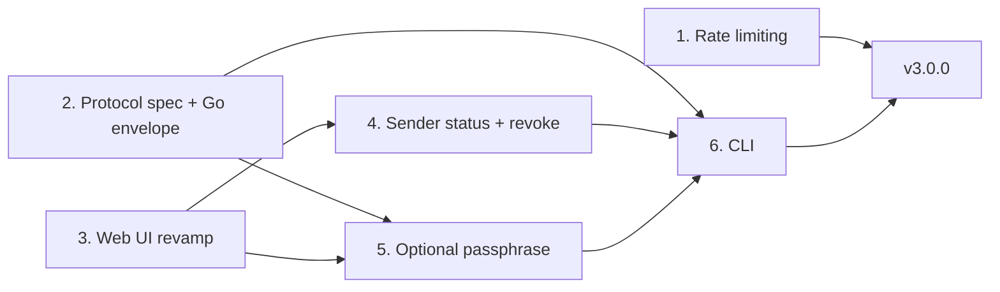

# Gone v3 Roadmap

Gone v3 adds abuse protection, a second factor for secrets, sender control, a command-line client, and a refreshed web interface. The core promise does not change: the server never sees plaintext or keys, and each secret is delivered to one recipient at most.

## Goals
* **Rate limiting** to make floods and ID guessing expensive.
* **Optional passphrase** so a leaked link alone cannot open a secret.
* **Sender status and revoke**: the sender can check whether a secret has been opened and destroy it before it is (manual, no webhooks).
* **CLI** to send and receive secrets from a terminal and in scripts.
* **Web UI revamp** so the new features feel like one product rather than add-ons.

## Non-goals
* Accounts, login, teams, or admin dashboards.
* Webhooks, email, or other push notifications.
* Secrets that can be opened more than once.
* Front-end frameworks or a build-time JS toolchain. The UI stays vanilla JS under a strict CSP.
* Running WebAssembly in the browser. Encryption stays on WebCrypto (see [Phase 2](#phase-2-protocol-spec-and-go-envelope)).

## Guiding principles
* **One phase, one pull request.** Each phase is reviewable, passes Codacy on its own, and leaves `main` releasable.
* **Zero knowledge stays intact.** No phase may give the server a key, a passphrase, or plaintext.
* **Compatible upgrades.** A v3 server still opens every v1 link created before the upgrade. Schema changes migrate automatically on startup.
* **Test coverage stays high.** Go and JS stay at or near 100% line coverage, and each phase adds tests for its new code.
* **Minimal dependencies.** Prefer the Go standard library and WebCrypto. Any new dependency needs a written reason in its PR.

## Phase order

Phases 1 and 2 are independent and can be worked on at the same time. The UI revamp comes before the two features with new screens, so those screens are built once, in the new design. The CLI comes last because it uses the API and encryption format the earlier phases settle.

---

## Phase 1: Rate limiting
**Status: done** (merged in #26).

Server-side only; the browser already shows a message on `429`.

**Scope**
* Per-client token buckets in `internal/httpx` middleware, written with the standard library.
* Separate budgets for creating secrets, claiming secrets, and (once Phase 4 lands) management calls. Health probes and static assets are not limited.
* Requests over the limit get `429 Too Many Requests` with a `Retry-After` header and the usual JSON error body.
* The client address comes from the connection by default. `X-Forwarded-For` is trusted only when the request arrives from an address listed in `GONE_TRUSTED_PROXIES`.
* Idle buckets are removed on a timer, so memory stays bounded under address churn.
* New `rate_limited_create_total` and `rate_limited_read_total` metrics counters. Client addresses are never logged.

**Configuration**
| Variable | Purpose |
| -------- | ------- |
| `GONE_RATE_CREATE` | Create budget (default `10/m`) |
| `GONE_RATE_READ` | Claim and acknowledge budget (default `30/m`) |
| `GONE_RATE_BURST` | Burst allowance per bucket (default `10`) |
| `GONE_TRUSTED_PROXIES` | CIDRs whose `X-Forwarded-For` header is trusted |

A budget of `0` turns that limit off.

**Done when**
* Middleware tests cover the bucket, header handling, proxy trust, and cleanup.
* `docs/openapi.yaml` documents `429` on the limited endpoints.
* The README configuration table and threat model are updated ("Brute force ID enumeration" and "DoS floods" move from out of scope to partially defended).

---

## Phase 2: Protocol spec and Go envelope
**Status: implemented** on `feat/protocol-envelope`.

No user-visible change. This phase writes down the encryption format and adds a Go copy of it, so the passphrase and CLI phases have a fixed reference to build on.

**Scope**
* `docs/protocol.md`: a precise v1 specification. It covers key and nonce generation, the AAD (`gone:v1`), the `GONE2` attachment envelope byte layout, the fragment format (`#v1:<base64url-key>`), and the claim/acknowledge exchange.
* `internal/envelope` (Go standard library only): encrypt, decrypt, and pack/unpack the `GONE2` envelope.
* Shared test data in `test/vectors/*.json`, checked by both `go test` and the `node:test` suite. If the browser and Go code disagree on a single byte, a test fails.
* Decide now how format versions are numbered, so Phase 5 does not have to.

**Why not WASM:** compiling the Go code to WASM for the browser would add about 2 MB to page loads, require loosening the CSP with `'wasm-unsafe-eval'`, give up WebCrypto's hardware-accelerated AES-GCM, and leave secrets in a garbage-collected heap that cannot be wiped. Two small implementations checked against the same test data are safer and lighter.

**Done when**
* Go and JS both pass every shared test case.
* `docs/protocol.md` is linked from the README and `docs/README.md`.

---

## Phase 3: Web UI revamp
A full redesign that keeps today's constraints: vanilla JS, no `innerHTML`, strict CSP, and no third-party assets.

**Scope**
* **Design tokens.** One set of CSS custom properties for color, spacing, type, radius, and motion, for both light and dark themes. `app.css` gets reorganized around them.
* **Reusable building blocks:** form fields, buttons, a copyable-link card, status badges, and alert/notice styles. Phases 4 and 5 use these without adding new patterns.
* **Rethought flows:**
  * *Send:* message, attachments, expiry, and a slot for the passphrase option.
  * *Result:* the share link plus a slot for the management link.
  * *Receive:* reveal, a slot for the passphrase prompt, and the error states (expired, already opened, wrong passphrase).
* **Accessibility:** target WCAG 2.2 AA. That means full keyboard operation, visible focus, correct labels and live regions, `prefers-reduced-motion` support, and sufficient contrast in both themes.
* **Responsive layout** that works from small phones to wide desktops.
* **Browser smoke tests:** add a small Playwright check of the send→receive round trip to CI.

**Done when**
* Every existing flow works with the same or fewer steps.
* JS line coverage stays at 100%, and stylelint and eslint pass.
* Before/after screenshots are attached to the PR.

---

## Phase 4: Sender status and revoke
The sender can see a secret's state and destroy it before it is opened.

**Scope**
* **Management token.** Creating a secret now also returns a random 256-bit `manage_token`. The server stores only its SHA-256 hash, the same way it handles claim tokens.
* **Management link:** `/manage/{id}#<manage_token>`. The token lives in the URL fragment, so it never reaches server logs or `Referer` headers.
* **API (proposed).** Both calls send the token in an `X-Gone-Manage` header. A wrong token gets the same `404` as an unknown ID.

  | Method | Path | Purpose |
  | ------ | ---- | ------- |
  | GET | `/api/secret/{id}/status` | Returns `pending`, `claimed`, `opened`, `revoked`, or `expired`, with timestamps |
  | POST | `/api/secret/{id}/revoke` | Deletes the ciphertext right away |

* **Tombstones.** When a secret is opened or revoked, the ciphertext is deleted at once. A small row (ID, management hash, state, timestamps) stays until the original expiry so the sender can still check its status. The janitor removes expired tombstones.
* **Schema migrations.** Add a small `PRAGMA user_version` migration step to the SQLite store, since the current schema can only be created, not altered. This phase adds the first migration: the management-hash column, the state, and the tombstone timestamps.
* **UI.** A management page using the Phase 3 components, and the management link shown on the result card.

**Open questions**
* Is it acceptable to keep a tombstone (no ciphertext) until the original expiry? The alternative is "unknown" once a secret is gone, which makes status much less useful.
* Should status show whether the recipient's claim lease is still active, or only whether the secret has been opened?

**Done when**
* Store, service, and handler tests cover each state change, including a revoke that races with a claim.
* `docs/openapi.yaml` and `docs/README.md` are updated, and rate limits apply to the new endpoints.

---

## Phase 5: Optional passphrase
A second factor: opening the secret needs both the link and a passphrase that the sender shares separately.

**Scope (proposed design)**
* **Key derivation.** The browser derives a key from the passphrase with PBKDF2-SHA-256 (built into WebCrypto). It uses a random 16-byte salt and at least 600,000 iterations, the current OWASP guidance. This derived key is combined with the fragment key using HKDF to produce the AES-GCM key, so the link alone and the passphrase alone are each useless.
* **New format version, v2.** The salt, iteration count, and KDF ID are stored in a small authenticated header in front of the ciphertext, and the AAD changes to `gone:v2`. The server stores v2 blobs as opaque bytes, just like v1. Clients still read v1, so existing links keep working.
* **Recipient flow.** The page detects a v2 link, asks for the passphrase, then claims and decrypts. If the passphrase is wrong, the recipient can retry while the claim lease lasts. The ciphertext never goes to anyone else.
* **Sender flow.** An optional passphrase field, with a strength hint and a reminder to send the passphrase through a different channel than the link.

**Threat model note.** The passphrase protects against a link that leaks *before* the real recipient opens it. Someone who claims the secret with a leaked link can still guess the passphrase offline, limited only by the passphrase's strength and PBKDF2's cost. The real recipient will then find the secret already opened, which is itself a warning. The README will say this plainly.

**Open questions**
* PBKDF2 now, or Argon2id from the start? Argon2id resists guessing much better, but it needs WASM loaded only on passphrase pages, plus a CSP exception. The recommendation is PBKDF2 for v3, with the KDF ID in the header leaving room to add Argon2id later.

**Done when**
* The shared test data covers v2, including a wrong-passphrase case.
* `docs/protocol.md`, the README security section, and the threat model are updated.

---

## Phase 6: CLI
A single static binary that can send and receive secrets.

**Scope**
* `cmd/gone-cli`, built on `internal/envelope`, the standard library, and `x/term` (to read a passphrase without echoing it).
* Commands (proposed):
  * `gone-cli send` reads standard input or a message argument, takes `--file`, `--ttl`, and `--passphrase-prompt`, and prints the share link and the management link.
  * `gone-cli get <link>` writes the message to standard output and attachments to a directory. It never overwrites an existing file unless `--force` is given.
  * `gone-cli status <manage-link>` and `gone-cli revoke <manage-link>`.
* **Server URL:** `--server` or `GONE_SERVER`. Plain HTTP is refused unless `--insecure` is given, which mirrors the web UI's warning.
* **Script-friendly output.** `--json` prints machine-readable results. Exit codes are fixed per outcome (not found, expired, wrong passphrase, rate limited).
* **Secret hygiene.** Keys are never accepted as command-line arguments in a way that reaches shell history. Passphrases are read from the terminal or a file descriptor. Plaintext buffers are wiped where Go allows it.
* **Releases.** The tag workflow builds the CLI for linux, darwin, and windows on amd64 and arm64. It publishes them with SHA-256 checksums and build-provenance attestations, alongside the container image.

**Open questions**
* Should it be a separate `gone-cli` binary, or `gone send` / `gone get` subcommands of the server binary? A separate binary is recommended: it keeps the container entrypoint unchanged and keeps server code out of the client.

**Done when**
* CLI and browser can exchange secrets in both directions, covered by integration tests in `test/`.
* The README has a CLI section, and the release notes include install instructions.

---

## Release plan
* Each phase merges to `main` on its own. Pre-release tags (`v3.0.0-alpha.N`) can be cut along the way for real-world testing.
* `v3.0.0` is tagged when all six phases have landed.
* The upgrade notes will cover:
  * the new environment variables;
  * the automatic schema migration;
  * the guarantee that v1 links created before the upgrade still open.

## Tracking
| Phase | Status |
| ----- | ------ |
| 1. Rate limiting | Done |
| 2. Protocol spec + Go envelope | Implemented |
| 3. Web UI revamp | Planned |
| 4. Sender status + revoke | Planned |
| 5. Optional passphrase | Planned |
| 6. CLI | Planned |
